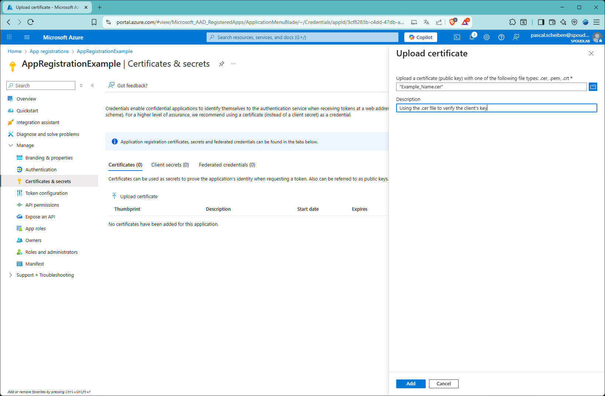
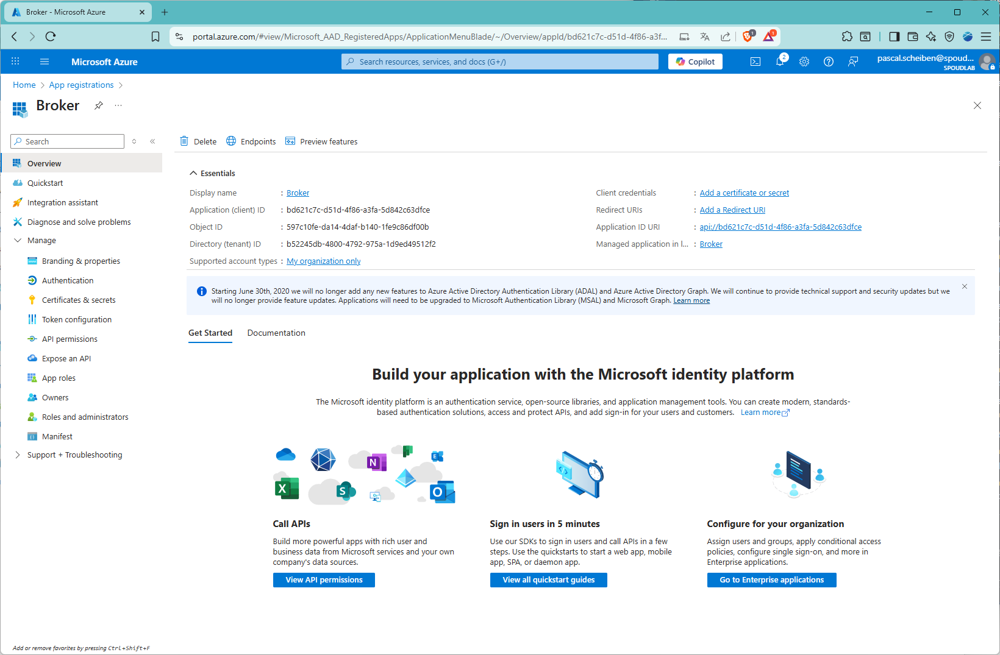

# Intro

We want to allow Kafka java client to get the JWT by authenticating on entra id with a client instead of a api secret.

## Microsoft documentation

https://learn.microsoft.com/en-us/entra/identity-platform/certificate-credentials

### Create a key and its certificate

```
KEY_ID=Example_Name
mkdir -p certs/$KEY_ID
openssl genrsa -out certs/$KEY_ID/$KEY_ID.key 2048
openssl req -new -key certs/$KEY_ID/$KEY_ID.key -out certs/$KEY_ID/$KEY_ID.csr -subj "/CN=${KEY_ID}"
openssl x509 -req -in certs/$KEY_ID/$KEY_ID.csr -signkey certs/$KEY_ID/$KEY_ID.key -out certs/$KEY_ID/$KEY_ID.crt -days 730
openssl x509 -outform pem -in certs/$KEY_ID/$KEY_ID.crt -out certs/$KEY_ID/$KEY_ID.cer
```

### Add it to the app registration

This app registration is used to represent your client application.

The `clientId` used later in the properties file is the "Application (client) ID"


* Left menu: Certificates & secrets
* Tab: Certificate
* Button: Upload certificate
* Right pop up menu: choose .cer certificate to upload and then "Add"


### "Server" application

This app registration is used to represent your broker.

Note the Application (client) ID, it will be needed for the scope


### Configuration for the client

* Add the jar to the classpath
* Example client.properties file

```
sasl.mechanism=OAUTHBEARER
sasl.login.callback.handler.class=io.spoud.azure.auth.certificate.CertOAuthBearerLoginCallbackHandler
sasl.login.connect.timeout.ms=15000
sasl.oauthbearer.token.endpoint.url=https://login.microsoftonline.com/b52245db-4800-4792-975a-1d9ed49512f2/oauth2/v2.0/token?appid=ea7b42c8-d515-4721-a8d7-7be12f446887
sasl.jaas.config=org.apache.kafka.common.security.oauthbearer.OAuthBearerLoginModule required \
clientId = "aa7ecbe8-8fde-4ac3-98d1-b5116ae00f7d" \
authority = "https://login.microsoftonline.com/b52245db-4800-4792-975a-1d9ed49512f2" \
scope = "api://ea7b42c8-d515-4721-a8d7-7be12f446887/.default" \
certificatePath = "/var/identity/certs/certificate.cer" \
privateKeyPath = "/var/identity/certs/private.key";

security.protocol=SASL_SSL
ssl.truststore.location=/var/ssl/private/kafka_broker.truststore.jks
ssl.truststore.password=confluenttruststorepass
```